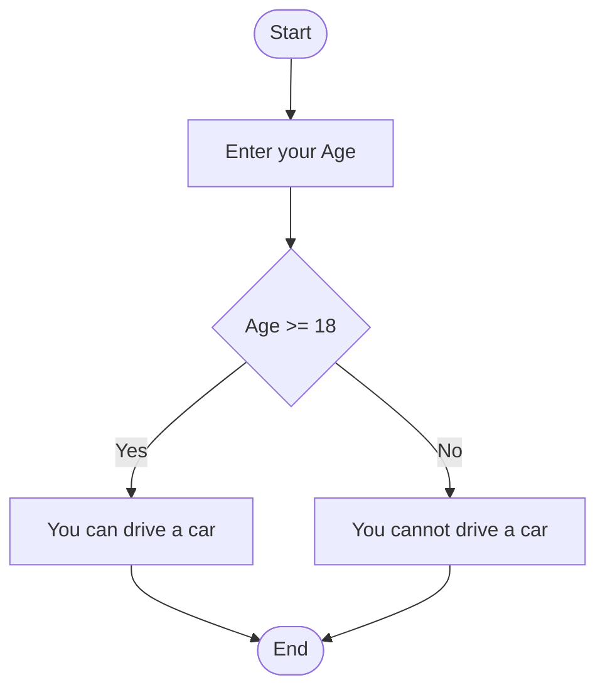

# Python Language

Python is a high-level, interpreted programming language known for its simplicity and readability. It supports multiple programming paradigms, including procedural, object-oriented, and functional programming. Python is widely used for web development, data analysis, artificial intelligence, scientific computing, and more, due to its extensive standard library and active community.

Key features of Python:
- Easy to learn and use.
- Cross-platform compatibility.
- Extensive libraries and frameworks.
- Strong community support.

For more information, visit the [official Python website](https://www.python.org/).

## What is a programming language?

A programming language is a formal set of instructions that can be used to communicate with a computer. It provides the syntax and semantics for writing programs that perform specific tasks or solve problems. Programming languages enable developers to create software, automate processes, and control hardware by translating human-readable code into machine-executable instructions.

## What is an interpreted programming language?

An interpreted programming language is a type of programming language in which code is executed directly by an interpreter, rather than being compiled into machine code beforehand. This allows for immediate execution of code, making it easier to test and debug programs. Interpreted languages are typically platform-independent, as the interpreter handles the translation of code into machine instructions. Examples of interpreted languages include Python, JavaScript, and Ruby.

## Execution modes in Python

Python has two primary execution modes:

### 1. Interactive Mode
Interactive mode allows users to execute Python code line by line in a command-line interface or shell. It is useful for testing small code snippets, debugging, or learning Python. To start the interactive mode, simply type `python` or `python3` in your terminal or command prompt.

#### Example:
```python
>>> print("Hello, World!")
Hello, World!
>>> 2 + 3
5
```

### 2. Script Mode
Script mode is used to execute Python programs saved in a file with a `.py` extension. This mode is ideal for writing and running complete programs. To execute a Python script, use the command `python script_name.py` in your terminal or command prompt.

#### Example:
Save the following code in a file named `example.py`:
```python
print("Hello, World!")
```

Run the script:
```bash
$ python example.py
Hello, World!
```

## What is an algorithm?

An algorithm is a step-by-step procedure or set of rules designed to solve a specific problem or perform a task. It is a finite sequence of well-defined instructions that take input, process it, and produce an output.

### Example Algorithm: Can You Drive?

Below is a simple algorithm in diagram form to check whether a person can drive a car based on their age:



## What is a variable?

A **variable** in programming is a **symbolic name** or reference that is used to **store data values**. It acts as a container for information that can be accessed and manipulated throughout a program. Variables allow developers to write flexible and reusable code by enabling the storage of different types of data, such as numbers, strings (text), or objects. The value of a variable can typically be changed during the execution of a program, making it a fundamental concept in programming.

### Types of variable in Python

#### Primitive Types in Python

A **primitive type** is a basic data type provided by a programming language as a building block for data manipulation. These types are typically simple and immutable, meaning their values cannot be changed once created. Primitive types are fundamental to programming and are used to represent simple values.

#### Common Types of Variables in Python

1. **int**: Represents integer numbers (e.g., `10`, `-5`).
2. **float**: Represents floating-point numbers or decimals (e.g., `3.14`, `-0.01`).
3. **complex**: Represents complex numbers with real and imaginary parts (e.g., `3+4j`).
4. **str**: Represents strings or sequences of characters (e.g., `"Hello"`, `'Python'`).
5. **bool**: Represents Boolean values (`True` or `False`).
6. **bytes**: Represents immutable sequences of bytes.
7. **bytearray**: Represents mutable sequences of bytes.
8. **NoneType**: Represents the absence of a value or a null value (`None`).

These types form the foundation for working with data in Python and are used extensively in programming tasks.

#### Range of Values for Common Python Types

| Type       | Range/Description                                                                 |
|------------|-----------------------------------------------------------------------------------|
| **int**    | Minimum: `-2^31` (-2,147,483,648), Maximum: `2^31 - 1` (2,147,483,647) (on 32-bit systems). On 64-bit systems, Python integers have unlimited precision, limited only by available memory. |
| **float**  | Approximately ±1.8 × 10^308 (64-bit floating-point representation).              |
| **complex**| No fixed range; consists of two floats (real and imaginary parts).               |
| **bool**   | Two possible values: `True` (1) and `False` (0).                                 |
| **str**    | No fixed length; limited by available memory.                                    |
| **bytes**  | Immutable sequence of bytes; length limited by available memory.                |
| **bytearray** | Mutable sequence of bytes; length limited by available memory.               |


## What is a Function?

A **function** in a programming language is a reusable block of code designed to perform a specific task, which can be executed when called, often with the ability to accept input parameters and return a result.


### Mathematical Operators in Python

Python provides a variety of mathematical operators for performing arithmetic and other mathematical operations:

1. **Addition (`+`)**: Adds two numbers.
    ```python
    result = 5 + 3  # result is 8
    ```

2. **Subtraction (`-`)**: Subtracts the second number from the first.
    ```python
    result = 5 - 3  # result is 2
    ```

3. **Multiplication (`*`)**: Multiplies two numbers.
    ```python
    result = 5 * 3  # result is 15
    ```

4. **Division (`/`)**: Divides the first number by the second, returning a float.
    ```python
    result = 5 / 2  # result is 2.5
    ```

5. **Floor Division (`//`)**: Divides the first number by the second, returning the largest integer less than or equal to the result.
    ```python
    result = 5 // 2  # result is 2
    ```

6. **Modulus (`%`)**: Returns the remainder of the division.
    ```python
    result = 5 % 2  # result is 1
    ```

7. **Exponentiation (`**`)**: Raises the first number to the power of the second.
    ```python
    result = 5 ** 3  # result is 125
    ```

8. **Unary Negation (`-`)**: Negates a number.
    ```python
    result = -5  # result is -5
    ```

These operators are fundamental for performing calculations and are widely used in Python programming.

### Logical Operators in Python

Logical operators are used to combine conditional statements or to perform logical operations on Boolean values (`True` or `False`). These operators are essential for decision-making and control flow in programming.

#### Common Logical Operators in Python

1. **and**: Returns `True` if both conditions are `True`.
    ```python
    result = (5 > 3) and (2 < 4)  # result is True
    ```

2. **or**: Returns `True` if at least one condition is `True`.
    ```python
    result = (5 > 3) or (2 > 4)  # result is True
    ```

3. **not**: Reverses the Boolean value of the condition.
    ```python
    result = not (5 > 3)  # result is False
    ```

Logical operators are widely used in conditional statements, loops, and expressions to control the flow of a program based on specific conditions.

### Truth Tables for Logical Operators

#### AND Operator (`and`)
| A     | B     | A and B |
|-------|-------|---------|
| True  | True  | True    |
| True  | False | False   |
| False | True  | False   |
| False | False | False   |

#### OR Operator (`or`)
| A     | B     | A or B  |
|-------|-------|---------|
| True  | True  | True    |
| True  | False | True    |
| False | True  | True    |
| False | False | False   |

#### NOT Operator (`not`)
| A     | not A |
|-------|-------|
| True  | False |
| False | True  |


### Comparison Operators in Python

Comparison operators are used to compare two values or expressions. They return a Boolean value (`True` or `False`) based on the comparison.

1. **Greater Than (`>`)**: Checks if the left operand is greater than the right.
    ```python
    result = 5 > 3  # result is True
    ```

2. **Less Than (`<`)**: Checks if the left operand is less than the right.
    ```python
    result = 5 < 3  # result is False
    ```

3. **Greater Than or Equal To (`>=`)**: Checks if the left operand is greater than or equal to the right.
    ```python
    result = 5 >= 3  # result is True
    ```

4. **Less Than or Equal To (`<=`)**: Checks if the left operand is less than or equal to the right.
    ```python
    result = 5 <= 3  # result is False
    ```

5. **Not Equal To (`!=`)**: Checks if the two operands are not equal.
    ```python
    result = 5 != 3  # result is True
    ```

These operators are commonly used in conditional statements and loops to control the flow of a program.


### Shortcut Operators in Python

Python provides shortcut operators, also known as compound assignment operators, to simplify mathematical expressions. These operators combine an arithmetic operation with assignment, making the code more concise.

#### Common Shortcut Operators

1. **Addition Assignment (`+=`)**: Adds the right operand to the left operand and assigns the result to the left operand.
    ```python
    x = 5
    x += 3  # Equivalent to x = x + 3
    # x is now 8
    ```

2. **Subtraction Assignment (`-=`)**: Subtracts the right operand from the left operand and assigns the result to the left operand.
    ```python
    x = 5
    x -= 3  # Equivalent to x = x - 3
    # x is now 2
    ```

3. **Multiplication Assignment (`*=`)**: Multiplies the left operand by the right operand and assigns the result to the left operand.
    ```python
    x = 5
    x *= 3  # Equivalent to x = x * 3
    # x is now 15
    ```

4. **Division Assignment (`/=`)**: Divides the left operand by the right operand and assigns the result to the left operand.
    ```python
    x = 5
    x /= 2  # Equivalent to x = x / 2
    # x is now 2.5
    ```

5. **Floor Division Assignment (`//=`)**: Performs floor division on the left operand by the right operand and assigns the result to the left operand.
    ```python
    x = 5
    x //= 2  # Equivalent to x = x // 2
    # x is now 2
    ```

6. **Modulus Assignment (`%=`)**: Calculates the remainder of the division of the left operand by the right operand and assigns the result to the left operand.
    ```python
    x = 5
    x %= 2  # Equivalent to x = x % 2
    # x is now 1
    ```

7. **Exponentiation Assignment (`**=`)**: Raises the left operand to the power of the right operand and assigns the result to the left operand.
    ```python
    x = 5
    x **= 3  # Equivalent to x = x ** 3
    # x is now 125
    ```

8. **Bitwise AND Assignment (`&=`)**: Performs a bitwise AND operation on the left and right operands and assigns the result to the left operand.
    ```python
    x = 5  # Binary: 0101
    x &= 3  # Equivalent to x = x & 3 (Binary: 0011)
    # x is now 1 (Binary: 0001)
    ```

9. **Bitwise OR Assignment (`|=`)**: Performs a bitwise OR operation on the left and right operands and assigns the result to the left operand.
    ```python
    x = 5  # Binary: 0101
    x |= 3  # Equivalent to x = x | 3 (Binary: 0011)
    # x is now 7 (Binary: 0111)
    ```

10. **Bitwise XOR Assignment (`^=`)**: Performs a bitwise XOR operation on the left and right operands and assigns the result to the left operand.
    ```python
    x = 5  # Binary: 0101
    x ^= 3  # Equivalent to x = x ^ 3 (Binary: 0011)
    # x is now 6 (Binary: 0110)
    ```

11. **Bitwise Left Shift Assignment (`<<=`)**: Shifts the bits of the left operand to the left by the number of positions specified by the right operand and assigns the result to the left operand.
    ```python
    x = 5  # Binary: 0101
    x <<= 1  # Equivalent to x = x << 1
    # x is now 10 (Binary: 1010)
    ```

12. **Bitwise Right Shift Assignment (`>>=`)**: Shifts the bits of the left operand to the right by the number of positions specified by the right operand and assigns the result to the left operand.
    ```python
    x = 5  # Binary: 0101
    x >>= 1  # Equivalent to x = x >> 1
    # x is now 2 (Binary: 0010)
    ```

These shortcut operators are useful for writing concise and efficient code.


## The `print` Function in Python

The `print` function is used to display output to the console. It is one of the most commonly used functions in Python and is essential for debugging and interacting with users.

### Syntax
```python
print(*objects, sep=' ', end='\n', file=sys.stdout, flush=False)
```

- `*objects`: One or more objects to be printed.
- `sep`: A string inserted between the objects (default is a space).
- `end`: A string appended after the last object (default is a newline).
- `file`: The file or stream where the output is sent (default is `sys.stdout`).
- `flush`: Whether to forcibly flush the stream (default is `False`).

### Examples

#### Normal Printing with Commas Between Variables
You can pass multiple variables to the `print` function, separated by commas. By default, a space is used as the separator.
```python
name = "Alice"
age = 25
print("Name:", name, "Age:", age)
# Output: Name: Alice Age: 25
```

You can also customize the separator using the `sep` parameter:
```python
print("Python", "is", "fun", sep="-")
# Output: Python-is-fun
```

#### Using f-Strings for Formatted Output
f-Strings (formatted string literals) provide a concise and readable way to include variables and expressions inside strings. They are prefixed with the letter `f` or `F`.

```python
name = "Alice"
age = 25
print(f"My name is {name} and I am {age} years old.")
# Output: My name is Alice and I am 25 years old.
```

You can also include expressions directly in f-Strings:
```python
a = 5
b = 3
print(f"The sum of {a} and {b} is {a + b}.")
# Output: The sum of 5 and 3 is 8.
```

The `print` function, combined with f-Strings, is a powerful tool for creating dynamic and user-friendly output in Python.

### Printing Formatted Numbers with f-Strings

f-Strings allow you to format numbers for better readability or specific requirements, such as controlling the number of decimal places or adding padding.

#### Examples

1. **Formatting Floating-Point Numbers**  
    You can specify the number of decimal places using `.nf`, where `n` is the number of decimal places.
    ```python
    pi = 3.141592653589793
    print(f"Pi to 2 decimal places: {pi:.2f}")
    # Output: Pi to 2 decimal places: 3.14
    ```

2. **Padding Numbers with Leading Zeros**  
    Use `0n` to pad numbers with leading zeros, where `n` is the total width.
    ```python
    number = 42
    print(f"Number with leading zeros: {number:05}")
    # Output: Number with leading zeros: 00042
    ```

3. **Aligning Numbers**  
    You can align numbers to the left, right, or center within a specified width using `<`, `>`, or `^`.
    ```python
    value = 123
    print(f"Right-aligned: {value:>6}")
    # Output: Right-aligned:    123
    print(f"Left-aligned: {value:<6}")
    # Output: Left-aligned: 123   
    print(f"Center-aligned: {value:^6}")
    # Output: Center-aligned:  123  
    ```

4. **Including Thousand Separators**  
    Use a comma (`,`) to include thousand separators for large numbers.
    ```python
    large_number = 1234567890
    print(f"Formatted with commas: {large_number:,}")
    # Output: Formatted with commas: 1,234,567,890
    ```

5. **Percentage Formatting**  
    Multiply a number by 100 and append a `%` symbol using `.nf%`.
    ```python
    success_rate = 0.857
    print(f"Success rate: {success_rate:.2%}")
    # Output: Success rate: 85.70%
    ```

6. **Scientific Notation**  
    Use `e` or `E` to format numbers in scientific notation.
    ```python
    small_number = 0.000123
    print(f"Scientific notation: {small_number:.2e}")
    # Output: Scientific notation: 1.23e-04
    ```

These formatting options make f-Strings a versatile tool for presenting numerical data in Python.


## Initializing Variables in Python

In Python, variables are initialized by assigning a value to a variable name using the assignment operator (`=`). Python is dynamically typed, meaning you do not need to specify the type of the variable explicitly; it is inferred based on the value assigned.

### Syntax
```python
variable_name = value
```

### Examples

1. **Initializing with Primitive Types**
    ```python
    # Integer
    age = 25

    # Float
    pi = 3.14

    # String
    name = "Alice"

    # Boolean
    is_active = True
    ```

2. **Initializing Multiple Variables**
    You can initialize multiple variables in a single line:
    ```python
    x, y, z = 1, 2, 3
    ```

    Or assign the same value to multiple variables:
    ```python
    a = b = c = 0
    ```

3. **Initializing with Complex Types**
    ```python
    # List
    fruits = ["apple", "banana", "cherry"]

    # Dictionary
    person = {"name": "Alice", "age": 25}

    # Tuple
    coordinates = (10, 20)

    # Set
    unique_numbers = {1, 2, 3}
    ```

4. **Using `None` for Uninitialized Variables**
    If you want to declare a variable without assigning a specific value, you can use `None`:
    ```python
    result = None
    ```

### Dynamic Typing
You can reassign a variable to a value of a different type:
```python
x = 10  # Initially an integer
x = "Hello"  # Now a string
```

This flexibility makes Python a powerful and easy-to-use language for variable initialization.


## Tuples, Lists, Dictionaries, and Sets in Python

Python provides several built-in data structures to store and manipulate collections of data. These include **tuples**, **lists**, **dictionaries**, and **sets**. Each has unique characteristics and use cases.

### Tuples
A **tuple** is an **ordered**, **immutable** collection of items. Once created, the elements of a tuple cannot be changed.

#### Syntax
```python
my_tuple = (1, 2, 3)
```

#### Example
```python
coordinates = (10, 20)
print(coordinates[0])  # Output: 10
```

#### Key Features
- Ordered: Elements have a defined order.
- Immutable: Cannot be modified after creation.
- Can contain duplicate elements.

---

### Lists
A **list** is an **ordered**, **mutable** collection of items. Lists are one of the most versatile data structures in Python.

#### Syntax
```python
my_list = [1, 2, 3]
```

#### Example
```python
fruits = ["apple", "banana", "cherry"]
fruits.append("orange")
print(fruits)  # Output: ['apple', 'banana', 'cherry', 'orange']
```

#### Key Features
- Ordered: Elements have a defined order.
- Mutable: Can be modified (add, remove, or change elements).
- Can contain duplicate elements.

---

### Dictionaries
A **dictionary** is an **unordered**, **mutable** collection of key-value pairs. Keys must be unique and immutable, while values can be of any type.

#### Syntax
```python
my_dict = {"key1": "value1", "key2": "value2"}
```

#### Example
```python
person = {"name": "Alice", "age": 25}
print(person["name"])  # Output: Alice
person["age"] = 26
print(person)  # Output: {'name': 'Alice', 'age': 26}
```

#### Key Features
- Unordered: No guaranteed order (insertion order preserved in Python 3.7+).
- Mutable: Can add, remove, or modify key-value pairs.
- Keys must be unique.

---

### Sets
A **set** is an **unordered**, **mutable** collection of unique elements. Sets are useful for operations like union, intersection, and difference.

#### Syntax
```python
my_set = {1, 2, 3}
```

#### Example
```python
unique_numbers = {1, 2, 3, 3}
print(unique_numbers)  # Output: {1, 2, 3}
unique_numbers.add(4)
print(unique_numbers)  # Output: {1, 2, 3, 4}
```

#### Key Features
- Unordered: No guaranteed order.
- Mutable: Can add or remove elements.
- Only unique elements are allowed.

---

### Differences Between Tuples and Lists

| Feature          | Tuple                          | List                          |
|------------------|--------------------------------|-------------------------------|
| **Mutability**   | Immutable                     | Mutable                      |
| **Syntax**       | Parentheses `()`              | Square brackets `[]`         |
| **Performance**  | Faster (due to immutability)  | Slower (due to mutability)   |
| **Use Case**     | Fixed data (e.g., coordinates)| Dynamic data (e.g., to-do list)|

#### Example
```python
# Tuple
coordinates = (10, 20)
# coordinates[0] = 15  # Error: Tuples are immutable

# List
fruits = ["apple", "banana"]
fruits[0] = "orange"  # Allowed: Lists are mutable
print(fruits)  # Output: ['orange', 'banana']
```

These data structures provide flexibility and efficiency for different programming scenarios.


## Using the `input` Function to Read Values

The `input` function in Python is used to take input from the user. It reads a line of text from the standard input (keyboard) and returns it as a string. You can use this function to read different types of values, such as strings, integers, and floats, by converting the input appropriately.

### Syntax
```python
variable = input(prompt)
```

- `prompt`: A string displayed to the user as a message (optional).

### Reading Strings
The `input` function directly returns the user input as a string.
```python
name = input("Enter your name: ")
print(f"Hello, {name}!")
# Example Input: Alice
# Output: Hello, Alice!
```

### Reading Integers
To read an integer, use the `int()` function to convert the input.
```python
age = int(input("Enter your age: "))
print(f"You are {age} years old.")
# Example Input: 25
# Output: You are 25 years old.
```

### Reading Floats
To read a floating-point number, use the `float()` function to convert the input.
```python
height = float(input("Enter your height in meters: "))
print(f"Your height is {height} meters.")
# Example Input: 1.75
# Output: Your height is 1.75 meters.
```

### Handling Multiple Inputs
You can use the `split()` method to read multiple values in a single line.
```python
x, y = input("Enter two numbers separated by a space: ").split()
x = int(x)
y = int(y)
print(f"The sum of {x} and {y} is {x + y}.")
# Example Input: 5 10
# Output: The sum of 5 and 10 is 15.
```

### Example: Combining Input Types
```python
name = input("Enter your name: ")
age = int(input("Enter your age: "))
height = float(input("Enter your height in meters: "))
print(f"Hello, {name}. You are {age} years old and {height} meters tall.")
# Example Input: Alice, 25, 1.75
# Output: Hello, Alice. You are 25 years old and 1.75 meters tall.
```

The `input` function is a versatile tool for interacting with users and collecting data in Python programs.


## Conditionals in Python: The `if` Statement

Conditionals are used in Python to execute specific blocks of code based on certain conditions. The `if` statement is the most basic form of conditional statement, allowing you to execute code only when a specified condition evaluates to `True`.

### Syntax
```python
if condition:
    # Code to execute if the condition is True
```

### Example 1: Basic `if` Statement
```python
age = 20
if age >= 18:
    print("You are eligible to vote.")
# Output: You are eligible to vote.
```

### Example 2: Using `if` with Logical Operators
```python
temperature = 25
if temperature > 20 and temperature < 30:
    print("The weather is pleasant.")
# Output: The weather is pleasant.
```

### Example 3: Nested `if` Statements
You can nest `if` statements to check multiple conditions.
```python
number = 15
if number > 0:
    if number % 2 == 0:
        print("The number is positive and even.")
    else:
        print("The number is positive and odd.")
# Output: The number is positive and odd.
```

### Indentation
Python uses indentation to define blocks of code. All statements inside the `if` block must be indented at the same level.

```python
x = 10
if x > 5:
    print("x is greater than 5")
    print("This is part of the if block")
# Output:
# x is greater than 5
# This is part of the if block
```

The `if` statement is a fundamental building block for decision-making in Python programs.


## Conditionals in Python: The `if-else` Statement

The `if-else` statement allows you to execute one block of code if a condition is `True` and another block of code if the condition is `False`. It provides a way to handle alternative scenarios in your program.

### Syntax
```python
if condition:
    # Code to execute if the condition is True
else:
    # Code to execute if the condition is False
```

### Example 1: Basic `if-else` Statement
```python
age = 16
if age >= 18:
    print("You are eligible to vote.")
else:
    print("You are not eligible to vote.")
# Output: You are not eligible to vote.
```

### Example 2: Using `if-else` with Logical Operators
```python
temperature = 15
if temperature > 20:
    print("The weather is warm.")
else:
    print("The weather is cold.")
# Output: The weather is cold.
```

### Example 3: Nested `if-else` Statements
You can nest `if-else` statements to handle multiple conditions.
```python
number = -5
if number > 0:
    print("The number is positive.")
else:
    if number == 0:
        print("The number is zero.")
    else:
        print("The number is negative.")
# Output: The number is negative.
```

The `if-else` statement is a powerful tool for decision-making, allowing you to handle different outcomes based on specific conditions.


## Conditionals in Python: The `if-elif-else` Statement

The `if-elif-else` statement allows you to check multiple conditions sequentially. It executes the block of code corresponding to the first condition that evaluates to `True`. If none of the conditions are `True`, the `else` block is executed.

### Syntax
```python
if condition1:
    # Code to execute if condition1 is True
elif condition2:
    # Code to execute if condition2 is True
elif condition3:
    # Code to execute if condition3 is True
else:
    # Code to execute if none of the conditions are True
```

### Example 1: Basic `if-elif-else` Statement
```python
grade = 85
if grade >= 90:
    print("You got an A.")
elif grade >= 80:
    print("You got a B.")
elif grade >= 70:
    print("You got a C.")
else:
    print("You need to improve.")
# Output: You got a B.
```

### Example 2: Using Multiple Conditions
```python
temperature = 35
if temperature > 40:
    print("It's extremely hot.")
elif temperature > 30:
    print("It's hot.")
elif temperature > 20:
    print("It's warm.")
else:
    print("It's cold.")
# Output: It's hot.
```

### Example 3: Nested `if-elif-else` Statements
You can nest `if-elif-else` statements to handle more complex conditions.
```python
age = 25
income = 50000
if age < 18:
    print("You are a minor.")
elif age >= 18:
    if income > 40000:
        print("You are an adult with a good income.")
    else:
        print("You are an adult with a low income.")
# Output: You are an adult with a good income.
```

The `if-elif-else` statement is a versatile tool for handling multiple conditions and making decisions in Python programs.


### Why Use `"is"` True or `"is"` False in Python?

In Python, the `"is"` operator is used to check **object identity**, meaning it determines whether two references point to the same object in memory. This is different from the `==` operator, which checks for **value equality**.

#### `"is"` True or `"is"` False
When comparing a value to `True` or `False`, using `"is"` checks whether the value is the exact `True` or `False` singleton object in memory. This is often used for clarity and to ensure that the comparison is explicitly against the Boolean constants.

#### Example
```python
x = True
if x is True:
    print("x is exactly True.")
# Output: x is exactly True
```

#### Why Use `"is"` Instead of `==`?
1. **Identity vs. Equality**:
   - `"is"` checks if two variables refer to the same object.
   - `==` checks if two variables have the same value, even if they are different objects.

   Example:
   ```python
   a = [1, 2, 3]
   b = [1, 2, 3]
   print(a == b)  # True (values are equal)
   print(a is b)  # False (different objects in memory)
   ```

2. **Explicit Boolean Comparison**:
   Using `"is"` ensures that the value being compared is explicitly `True` or `False`, avoiding unintended truthy or falsy evaluations.

   Example:
   ```python
   x = 1
   print(x == True)  # True (1 is truthy)
   print(x is True)  # False (1 is not the True object)
   ```

#### When to Use `"is"` True or `"is"` False
- Use `"is"` when you want to ensure the value is the exact `True` or `False` object.
- Avoid using `"is"` for general comparisons; use `==` for value equality instead.

By understanding the difference between `"is"` and `==`, you can write more precise and intentional Python code.


## The `in` Keyword in Conditionals

The `in` keyword in Python is used to check if a value exists within a sequence, such as a list, tuple, string, or dictionary. It is commonly used in conditional statements to make decisions based on membership.

### Syntax
```python
if value in sequence:
    # Code to execute if value is in sequence
```

### Examples

#### Example 1: Checking Membership in a List
```python
fruits = ["apple", "banana", "cherry"]
if "apple" in fruits:
    print("Apple is in the list!")
# Output: Apple is in the list!
```

#### Example 2: Checking Membership in a String
```python
text = "Hello, World!"
if "World" in text:
    print("The word 'World' is in the text.")
# Output: The word 'World' is in the text.
```

#### Example 3: Checking Keys in a Dictionary
```python
person = {"name": "Alice", "age": 25}
if "name" in person:
    print("The key 'name' exists in the dictionary.")
# Output: The key 'name' exists in the dictionary.
```

#### Example 4: Using `not in` for Negation
You can use `not in` to check if a value is not present in a sequence.
```python
numbers = [1, 2, 3, 4, 5]
if 6 not in numbers:
    print("6 is not in the list.")
# Output: 6 is not in the list.
```

### Use Cases
- Validating user input against a list of allowed values.
- Searching for substrings in text.
- Checking for the existence of keys in dictionaries.

The `in` keyword is a powerful and concise way to test membership in Python, making it a valuable tool in conditional statements.


## Loops in Python: The `while` Loop

A **`while` loop** in Python is used to repeatedly execute a block of code as long as a specified condition evaluates to `True`. It is particularly useful when the number of iterations is not known beforehand and depends on a condition being met.

### Syntax
```python
while condition:
    # Code to execute while the condition is True
```

- **`condition`**: A Boolean expression that is evaluated before each iteration. If it evaluates to `True`, the loop continues; otherwise, it stops.

### Example 1: Basic `while` Loop
```python
count = 0
while count < 5:
    print(f"Count is {count}")
    count += 1
# Output:
# Count is 0
# Count is 1
# Count is 2
# Count is 3
# Count is 4
```

### Example 2: Using a `while` Loop with a User Input
```python
password = ""
while password != "secret":
    password = input("Enter the password: ")
print("Access granted!")
# Example Input: wrong, secret
# Output:
# Enter the password: wrong
# Enter the password: secret
# Access granted!
```

### Infinite Loops
A `while` loop can run indefinitely if the condition never becomes `False`. To avoid this, ensure the condition will eventually be met or use a `break` statement to exit the loop.

#### Example of an Infinite Loop with `break`:
```python
while True:
    user_input = input("Type 'exit' to quit: ")
    if user_input == "exit":
        break
print("Goodbye!")
# Example Input: hello, exit
# Output:
# Type 'exit' to quit: hello
# Type 'exit' to quit: exit
# Goodbye!
```

### Key Points
- The `while` loop is ideal for situations where the number of iterations depends on a condition.
- Be cautious of infinite loops by ensuring the condition will eventually evaluate to `False`.
- Use the `break` statement to exit a loop prematurely if needed.

The `while` loop is a fundamental control structure in Python, enabling repetitive tasks based on dynamic conditions.


## The `break` and `continue` Statements in Python

The `break` and `continue` statements are used to control the flow of loops in Python. They allow you to alter the normal behavior of loops by either exiting the loop prematurely (`break`) or skipping the current iteration and continuing with the next one (`continue`).

### The `break` Statement

The `break` statement is used to exit a loop immediately, regardless of the loop's condition. Once the `break` statement is executed, the program continues with the first statement after the loop.

#### Example 1: Exiting a `while` Loop
```python
count = 0
while count < 10:
    if count == 5:
        break
    print(f"Count is {count}")
    count += 1
# Output:
# Count is 0
# Count is 1
# Count is 2
# Count is 3
# Count is 4
```

#### Example 2: Exiting a `for` Loop
```python
for number in range(10):
    if number == 7:
        break
    print(f"Number is {number}")
# Output:
# Number is 0
# Number is 1
# Number is 2
# Number is 3
# Number is 4
# Number is 5
# Number is 6
```

### The `continue` Statement

The `continue` statement is used to skip the rest of the code in the current iteration and move to the next iteration of the loop. It does not terminate the loop but allows you to bypass certain conditions.

#### Example 1: Skipping an Iteration in a `while` Loop
```python
count = 0
while count < 10:
    count += 1
    if count % 2 == 0:
        continue
    print(f"Count is {count}")
# Output:
# Count is 1
# Count is 3
# Count is 5
# Count is 7
# Count is 9
```

#### Example 2: Skipping an Iteration in a `for` Loop
```python
for number in range(10):
    if number % 2 == 0:
        continue
    print(f"Number is {number}")
# Output:
# Number is 1
# Number is 3
# Number is 5
# Number is 7
# Number is 9
```

### Key Differences Between `break` and `continue`

| Feature         | `break`                          | `continue`                     |
|------------------|----------------------------------|---------------------------------|
| **Purpose**      | Exits the loop entirely.         | Skips the current iteration.   |
| **Effect**       | Terminates the loop immediately. | Proceeds to the next iteration.|
| **Use Case**     | When you need to stop the loop.  | When you need to skip specific iterations. |

The `break` and `continue` statements are powerful tools for controlling loop behavior, making your code more flexible and efficient.


## Loops in Python: The `for` Loop

A **`for` loop** in Python is used to iterate over a sequence (such as a list, tuple, string, or range) and execute a block of code for each element in the sequence. It is particularly useful when the number of iterations is known beforehand.

### Syntax
```python
for variable in sequence:
    # Code to execute for each element in the sequence
```

- **`variable`**: A temporary variable that takes the value of each element in the sequence during each iteration.
- **`sequence`**: The collection of items to iterate over.

### Example 1: Iterating Over a List
```python
fruits = ["apple", "banana", "cherry"]
for fruit in fruits:
    print(f"I like {fruit}")
# Output:
# I like apple
# I like banana
# I like cherry
```

### Example 2: Using `range()` in a `for` Loop
The `range()` function generates a sequence of numbers, which is commonly used in `for` loops.

```python
for number in range(5):
    print(f"Number: {number}")
# Output:
# Number: 0
# Number: 1
# Number: 2
# Number: 3
# Number: 4
```

You can also specify a start, stop, and step in the `range()` function:
```python
for number in range(1, 10, 2):
    print(f"Odd number: {number}")
# Output:
# Odd number: 1
# Odd number: 3
# Odd number: 5
# Odd number: 7
# Odd number: 9
```

### Example 3: Iterating Over a String
A string is a sequence of characters, so you can iterate over it using a `for` loop.

```python
text = "Python"
for char in text:
    print(char)
# Output:
# P
# y
# t
# h
# o
# n
```

### Example 4: Iterating Over a Dictionary
When iterating over a dictionary, you can access its keys, values, or both.

```python
person = {"name": "Alice", "age": 25}
for key, value in person.items():
    print(f"{key}: {value}")
# Output:
# name: Alice
# age: 25
```

### Example 5: Nested `for` Loops
You can use a `for` loop inside another `for` loop to iterate over multiple sequences.

```python
rows = 3
cols = 2
for i in range(rows):
    for j in range(cols):
        print(f"Row {i}, Column {j}")
# Output:
# Row 0, Column 0
# Row 0, Column 1
# Row 1, Column 0
# Row 1, Column 1
# Row 2, Column 0
# Row 2, Column 1
```

The `for` loop is a versatile and powerful tool for iterating over sequences and performing repetitive tasks in Python.


### Examples of `for` Loop Using `range()`

The `range()` function is commonly used in `for` loops to generate a sequence of numbers. Below are examples demonstrating its usage with different parameters.

#### Example 1: Using `range(stop)`
When a single value is provided, `range()` generates numbers starting from `0` up to (but not including) the specified `stop` value.
```python
for i in range(5):
    print(i)
# Output:
# 0
# 1
# 2
# 3
# 4
```

#### Example 2: Using `range(start, stop)`
When two values are provided, `range()` generates numbers starting from `start` up to (but not including) `stop`.
```python
for i in range(2, 6):
    print(i)
# Output:
# 2
# 3
# 4
# 5
```

#### Example 3: Using `range(start, stop, step)`
When three values are provided, `range()` generates numbers starting from `start`, incrementing by `step`, up to (but not including) `stop`.
```python
for i in range(1, 10, 2):
    print(i)
# Output:
# 1
# 3
# 5
# 7
# 9
```

#### Example 4: Using Negative `step`
You can use a negative `step` to generate numbers in reverse order.
```python
for i in range(10, 0, -2):
    print(i)
# Output:
# 10
# 8
# 6
# 4
# 2
```

#### Example 5: Using `range()` with Zero or Negative Values
If `start` is greater than or equal to `stop` and `step` is positive, or if `step` is zero, the `range()` function produces no output.
```python
for i in range(5, 5):
    print(i)
# Output: (No output)

for i in range(5, 1, 0):  # Invalid: step cannot be zero
    print(i)
# Output: ValueError: range() arg 3 must not be zero
```

#### Example 6: Iterating Backward with `range()`
To iterate backward, ensure `start` is greater than `stop` and use a negative `step`.
```python
for i in range(5, 0, -1):
    print(i)
# Output:
# 5
# 4
# 3
# 2
# 1
```

These examples demonstrate the flexibility of the `range()` function in generating sequences for iteration in Python.


### Using `enumerate` in Python

The `enumerate` function in Python is used to iterate over a sequence (such as a list, tuple, or string) while keeping track of the index of each element. It returns an iterator that produces pairs of an index and the corresponding element.

#### Syntax
```python
enumerate(iterable, start=0)
```

- **`iterable`**: The sequence to iterate over.
- **`start`**: The starting index (default is `0`).

#### Example 1: Basic Usage of `enumerate`
```python
fruits = ["apple", "banana", "cherry"]
for index, fruit in enumerate(fruits):
    print(f"Index {index}: {fruit}")
# Output:
# Index 0: apple
# Index 1: banana
# Index 2: cherry
```

#### Example 2: Using a Custom Start Index
You can specify a custom starting index using the `start` parameter.
```python
fruits = ["apple", "banana", "cherry"]
for index, fruit in enumerate(fruits, start=1):
    print(f"Item {index}: {fruit}")
# Output:
# Item 1: apple
# Item 2: banana
# Item 3: cherry
```

#### Example 3: Enumerating Over a String
The `enumerate` function can also be used with strings to get the index and character.
```python
text = "Python"
for index, char in enumerate(text):
    print(f"Character at index {index}: {char}")
# Output:
# Character at index 0: P
# Character at index 1: y
# Character at index 2: t
# Character at index 3: h
# Character at index 4: o
# Character at index 5: n
```

#### Example 4: Enumerating Over a Tuple
You can use `enumerate` with tuples to iterate over both the index and the value.
```python
colors = ("red", "green", "blue")
for index, color in enumerate(colors):
    print(f"Color {index}: {color}")
# Output:
# Color 0: red
# Color 1: green
# Color 2: blue
```

#### Example 5: Enumerating Over a List of Dictionaries
When working with complex data structures, `enumerate` can help keep track of the index.
```python
people = [{"name": "Alice", "age": 25}, {"name": "Bob", "age": 30}]
for index, person in enumerate(people):
    print(f"Person {index}: {person['name']} is {person['age']} years old.")
# Output:
# Person 0: Alice is 25 years old.
# Person 1: Bob is 30 years old.
```

#### Example 6: Using `enumerate` with a `for` Loop and Conditional Statements
You can combine `enumerate` with conditional logic to process specific elements.
```python
numbers = [10, 20, 30, 40, 50]
for index, number in enumerate(numbers):
    if number > 30:
        print(f"Number at index {index} is greater than 30: {number}")
# Output:
# Number at index 3 is greater than 30: 40
# Number at index 4 is greater than 30: 50
```

The `enumerate` function is a powerful tool for iterating over sequences while keeping track of the index, making your code more readable and efficient.


## Working with and Iterating Over Lists

Lists are one of the most versatile data structures in Python. They allow you to store and manipulate collections of items. Below are examples of how to work with and iterate over lists.

### Creating and Accessing Lists
You can create a list using square brackets `[]` and access elements using their index.
```python
# Creating a list
fruits = ["apple", "banana", "cherry"]

# Accessing elements
print(fruits[0])  # Output: apple
print(fruits[-1])  # Output: cherry
```

### Iterating Over a List
You can use a `for` loop to iterate over the elements of a list.
```python
fruits = ["apple", "banana", "cherry"]
for fruit in fruits:
    print(f"I like {fruit}")
# Output:
# I like apple
# I like banana
# I like cherry
```

### Iterating with Indexes
Use the `range()` function to iterate over the indexes of a list.
```python
fruits = ["apple", "banana", "cherry"]
for i in range(len(fruits)):
    print(f"Index {i}: {fruits[i]}")
# Output:
# Index 0: apple
# Index 1: banana
# Index 2: cherry
```

### Using `enumerate` for Index and Value
The `enumerate` function provides both the index and the value during iteration.
```python
fruits = ["apple", "banana", "cherry"]
for index, fruit in enumerate(fruits):
    print(f"Index {index}: {fruit}")
# Output:
# Index 0: apple
# Index 1: banana
# Index 2: cherry
```

### Iterating Over a List with Conditional Logic
You can apply conditions while iterating over a list.
```python
numbers = [10, 15, 20, 25, 30]
for number in numbers:
    if number % 2 == 0:
        print(f"{number} is even")
    else:
        print(f"{number} is odd")
# Output:
# 10 is even
# 15 is odd
# 20 is even
# 25 is odd
# 30 is even
```

### Iterating Over Nested Lists
You can use nested loops to iterate over lists of lists.
```python
matrix = [
    [1, 2, 3],
    [4, 5, 6],
    [7, 8, 9]
]
for row in matrix:
    for element in row:
        print(element, end=" ")
    print()
# Output:
# 1 2 3
# 4 5 6
# 7 8 9
```

### List Comprehensions
List comprehensions provide a concise way to create or transform lists.
```python
# Creating a list of squares
squares = [x**2 for x in range(5)]
print(squares)  # Output: [0, 1, 4, 9, 16]

# Filtering a list
numbers = [1, 2, 3, 4, 5]
even_numbers = [x for x in numbers if x % 2 == 0]
print(even_numbers)  # Output: [2, 4]
```

### Modifying a List While Iterating
Use caution when modifying a list while iterating over it. A common approach is to iterate over a copy of the list.
```python
numbers = [1, 2, 3, 4, 5]
for number in numbers[:]:  # Iterate over a copy
    if number % 2 == 0:
        numbers.remove(number)
print(numbers)  # Output: [1, 3, 5]
```

These examples demonstrate various ways to work with and iterate over lists in Python, making them a powerful and flexible tool for managing collections of data.


## Advanced Slicing Operations in NumPy

Slicing in NumPy allows you to extract specific portions of an array using various combinations of start, end, and step values. Below are examples demonstrating advanced slicing techniques.

### 1. Basic Slicing with `:`
The colon (`:`) operator selects all elements along a specific axis.

#### Example: Selecting All Rows or Columns
```python
import numpy as np

arr = np.array([[1, 2, 3], [4, 5, 6], [7, 8, 9]])
print(arr[:, :])  # Selects all rows and columns
# Output:
# [[1 2 3]
#  [4 5 6]
#  [7 8 9]]
```

---

### 2. Slicing with `::`
The double colon (`::`) allows you to specify a step value to skip elements.

#### Example: Selecting Every Second Row and Column
```python
print(arr[::2, ::2])
# Output:
# [[1 3]
#  [7 9]]
```

---

### 3. Reversing with `::-1`
A negative step value reverses the order of elements.

#### Example: Reversing Rows
```python
print(arr[::-1, :])  # Reverses the order of rows
# Output:
# [[7 8 9]
#  [4 5 6]
#  [1 2 3]]
```

#### Example: Reversing Columns
```python
print(arr[:, ::-1])  # Reverses the order of columns
# Output:
# [[3 2 1]
#  [6 5 4]
#  [9 8 7]]
```

---

### 4. Skipping Elements with `::-2`
You can combine negative steps with skipping elements.

#### Example: Reversing and Skipping Every Second Row
```python
print(arr[::-2, :])  # Reverses and skips every second row
# Output:
# [[7 8 9]
#  [1 2 3]]
```

#### Example: Reversing and Skipping Every Second Column
```python
print(arr[:, ::-2])  # Reverses and skips every second column
# Output:
# [[3 1]
#  [6 4]
#  [9 7]]
```

---

### 5. Combining Multiple Slicing Techniques
You can combine slicing techniques for more complex operations.

#### Example: Extracting and Reversing a Subarray
```python
print(arr[1:, ::-1])  # Selects rows from index 1 and reverses columns
# Output:
# [[6 5 4]
#  [9 8 7]]
```

These advanced slicing techniques provide powerful ways to manipulate and extract data from NumPy arrays efficiently.

### Iterating Over Dictionaries

Dictionaries in Python store data as key-value pairs. You can iterate over dictionaries to access keys, values, or both.

#### Example 1: Iterating Over Keys
```python
person = {"name": "Alice", "age": 25, "city": "New York"}
for key in person:
    print(f"Key: {key}")
# Output:
# Key: name
# Key: age
# Key: city
```

#### Example 2: Iterating Over Values
```python
person = {"name": "Alice", "age": 25, "city": "New York"}
for value in person.values():
    print(f"Value: {value}")
# Output:
# Value: Alice
# Value: 25
# Value: New York
```

#### Example 3: Iterating Over Key-Value Pairs
```python
person = {"name": "Alice", "age": 25, "city": "New York"}
for key, value in person.items():
    print(f"{key}: {value}")
# Output:
# name: Alice
# age: 25
# city: New York
```

#### Example 4: Using Conditional Logic While Iterating
```python
person = {"name": "Alice", "age": 25, "city": "New York"}
for key, value in person.items():
    if key == "age":
        print(f"Age found: {value}")
# Output:
# Age found: 25
```

These examples demonstrate how to efficiently iterate over dictionaries to access and manipulate their contents.


## What is a Python Package and Module?

### Python Module
A **module** in Python is a single file containing Python code that can define functions, classes, and variables. Modules are used to organize code into reusable components, making it easier to maintain and share.

#### Creating a Module
To create a module, simply save a Python file with a `.py` extension.

**Example: `math_utils.py`**
```python
def add(a, b):
    return a + b

def subtract(a, b):
    return a - b
```

#### Using a Module
You can import a module into another Python file or the interactive shell using the `import` statement.

**Example: Importing `math_utils`**
```python
import math_utils

result = math_utils.add(5, 3)
print(result)  # Output: 8
```

You can also import specific functions or classes:
```python
from math_utils import subtract

result = subtract(10, 4)
print(result)  # Output: 6
```


## The `math` Library in Python

The `math` library in Python provides a wide range of mathematical functions and constants, making it a powerful tool for performing mathematical operations. It is part of Python's standard library, so no additional installation is required.

### Importing the `math` Library
To use the `math` library, you need to import it:
```python
import math
```

### Commonly Used Functions in the `math` Library

1. **Basic Mathematical Functions**
    - `math.sqrt(x)`: Returns the square root of `x`.
      ```python
      print(math.sqrt(16))  # Output: 4.0
      ```
    - `math.pow(x, y)`: Returns `x` raised to the power of `y`.
      ```python
      print(math.pow(2, 3))  # Output: 8.0
      ```
    - `math.ceil(x)`: Rounds `x` up to the nearest integer.
      ```python
      print(math.ceil(4.2))  # Output: 5
      ```
    - `math.floor(x)`: Rounds `x` down to the nearest integer.
      ```python
      print(math.floor(4.8))  # Output: 4
      ```

2. **Trigonometric Functions**
    - `math.sin(x)`, `math.cos(x)`, `math.tan(x)`: Compute the sine, cosine, and tangent of `x` (in radians).
      ```python
      print(math.sin(math.pi / 2))  # Output: 1.0
      ```
    - `math.asin(x)`, `math.acos(x)`, `math.atan(x)`: Compute the inverse sine, cosine, and tangent of `x`.
      ```python
      print(math.asin(1))  # Output: 1.5707963267948966 (π/2)
      ```

3. **Logarithmic and Exponential Functions**
    - `math.log(x, base)`: Returns the logarithm of `x` to the specified `base` (default is `e`).
      ```python
      print(math.log(8, 2))  # Output: 3.0
      ```
    - `math.exp(x)`: Returns `e` raised to the power of `x`.
      ```python
      print(math.exp(1))  # Output: 2.718281828459045
      ```

4. **Constants**
    - `math.pi`: The mathematical constant π (approximately 3.14159).
      ```python
      print(math.pi)  # Output: 3.141592653589793
      ```
    - `math.e`: The mathematical constant e (approximately 2.71828).
      ```python
      print(math.e)  # Output: 2.718281828459045
      ```

5. **Factorial and Combinatorics**
    - `math.factorial(x)`: Returns the factorial of `x`.
      ```python
      print(math.factorial(5))  # Output: 120
      ```
    - `math.comb(n, k)`: Returns the number of ways to choose `k` items from `n` items without repetition.
      ```python
      print(math.comb(5, 2))  # Output: 10
      ```
    - `math.perm(n, k)`: Returns the number of

---

### Python Package
A **package** in Python is a collection of modules organized in a directory hierarchy. A package must contain a special file named `__init__.py`, which can be empty or contain initialization code for the package.

#### Creating a Package
To create a package, organize your modules in a directory and include an `__init__.py` file.

**Example: Directory Structure**
```
my_package/
    __init__.py
    math_utils.py
    string_utils.py
```

**`math_utils.py`**
```python
def multiply(a, b):
    return a * b
```

**`string_utils.py`**
```python
def to_uppercase(s):
    return s.upper()
```

#### Using a Package
You can import modules from a package using the `import` statement.

**Example: Importing from `my_package`**
```python
from my_package.math_utils import multiply
from my_package.string_utils import to_uppercase

print(multiply(3, 4))  # Output: 12
print(to_uppercase("hello"))  # Output: HELLO
```

---

### Key Differences Between Modules and Packages
| Feature         | Module                          | Package                          |
|------------------|---------------------------------|----------------------------------|
| **Definition**   | A single Python file (`.py`).  | A directory containing multiple modules and an `__init__.py` file. |
| **Purpose**      | Organize reusable code.        | Group related modules together. |
| **Import**       | `import module_name`           | `from package_name import module_name` |

Modules and packages are essential for structuring Python projects, promoting code reuse, and improving maintainability.


## What is NumPy?

NumPy, short for **Numerical Python**, is a powerful library in Python used for numerical computing. It provides support for large, multi-dimensional arrays and matrices, along with a collection of mathematical functions to operate on these arrays efficiently. NumPy is widely used in scientific computing, data analysis, machine learning, and engineering applications.

### Key Features of NumPy:
1. **N-Dimensional Array Object (`ndarray`)**: Provides a fast and flexible data structure for handling large datasets.
2. **Mathematical Functions**: Includes a wide range of mathematical operations, such as linear algebra, statistical functions, and Fourier transforms.
3. **Broadcasting**: Enables operations on arrays of different shapes without the need for explicit looping.
4. **Integration with Other Libraries**: Works seamlessly with libraries like Pandas, Matplotlib, and SciPy.
5. **Performance**: Written in C, making it much faster than standard Python lists for numerical operations.

### Why Use NumPy?
- **Efficiency**: NumPy arrays are more memory-efficient and faster than Python lists for numerical computations.
- **Convenience**: Provides a rich set of tools for array manipulation, making it easier to perform complex operations.
- **Foundation for Other Libraries**: Many popular libraries, such as Pandas and TensorFlow, are built on top of NumPy.

### Example: Creating and Manipulating Arrays
```python
import numpy as np

# Creating a 1D array
arr = np.array([1, 2, 3, 4, 5])
print("1D Array:", arr)

# Creating a 2D array
matrix = np.array([[1, 2, 3], [4, 5, 6]])
print("2D Array:\n", matrix)

# Performing operations
print("Array Sum:", np.sum(arr))
print("Matrix Transpose:\n", matrix.T)
```

### Common Use Cases:
1. **Data Analysis**: Efficiently handle and process large datasets.
2. **Scientific Computing**: Perform complex mathematical operations like matrix multiplication and eigenvalue computation.
3. **Machine Learning**: Serve as the foundation for data preprocessing and numerical computations.
4. **Image Processing**: Manipulate pixel data in images using multi-dimensional arrays.

For more information, visit the [official NumPy documentation](https://numpy.org/doc/).


### NumPy Data Types (`dtypes`)

NumPy provides a variety of data types (`dtypes`) to represent different kinds of numerical data. These data types allow you to control the precision and memory usage of your arrays. Below are some commonly used `dtypes` in NumPy:

#### Common NumPy Data Types
1. **Integer Types**:
    - `int8`: 8-bit signed integer.
    - `int32`: 32-bit signed integer.
    - `int64`: 64-bit signed integer.
    - `uint8`: 8-bit unsigned integer.
    - `uint32`: 32-bit unsigned integer.
    - `uint64`: 64-bit unsigned integer.

2. **Floating-Point Types**:
    - `float16`: 16-bit floating-point number.
    - `float32`: 32-bit floating-point number.
    - `float64`: 64-bit floating-point number (double precision).
    - `float128`: 128-bit floating-point number (extended precision, platform-dependent).

---

### Creating Arrays with Specific `dtypes`

You can specify the `dtype` when creating a NumPy array using the `dtype` parameter.

#### Example: Creating Arrays with Integer Types
```python
import numpy as np

# Creating an array with int32
arr_int32 = np.array([1, 2, 3], dtype=np.int32)
print(arr_int32)

# Creating an array with uint8
arr_uint8 = np.array([255, 128, 64], dtype=np.uint8)
print(arr_uint8)
```

#### Example: Creating Arrays with Floating-Point Types
```python
# Creating an array with float32
arr_float32 = np.array([1.5, 2.5, 3.5], dtype=np.float32)
print(arr_float32)

# Creating an array with float64
arr_float64 = np.array([1.123456789, 2.987654321], dtype=np.float64)
print(arr_float64)
```

#### Example: Creating a Matrix with Specific `dtypes`
```python
# Creating a 2D matrix with int64
matrix_int64 = np.array([[1, 2], [3, 4]], dtype=np.int64)
print(matrix_int64)

# Creating a 2D matrix with float16
matrix_float16 = np.array([[1.1, 2.2], [3.3, 4.4]], dtype=np.float16)
print(matrix_float16)
```

---

### Range of Values for NumPy Data Types

The following table summarizes the minimum and maximum range for common NumPy data types:

| **Data Type** | **Description**          | **Minimum Value**         | **Maximum Value**         |
|---------------|--------------------------|---------------------------|---------------------------|
| `int8`        | 8-bit signed integer     | -128                      | 127                       |
| `int32`       | 32-bit signed integer    | -2,147,483,648            | 2,147,483,647             |
| `int64`       | 64-bit signed integer    | -9,223,372,036,854,775,808| 9,223,372,036,854,775,807 |
| `uint8`       | 8-bit unsigned integer   | 0                         | 255                       |
| `uint32`      | 32-bit unsigned integer  | 0                         | 4,294,967,295             |
| `uint64`      | 64-bit unsigned integer  | 0                         | 18,446,744,073,709,551,615|
| `float16`     | 16-bit floating-point    | ~-65,504                  | ~65,504                   |
| `float32`     | 32-bit floating-point    | ~-3.4 × 10^38             | ~3.4 × 10^38              |
| `float64`     | 64-bit floating-point    | ~-1.8 × 10^308            | ~1.8 × 10^308             |
| `float128`    | 128-bit floating-point   | ~-1.1 × 10^4932           | ~1.1 × 10^4932            |

---

By selecting the appropriate `dtype`, you can optimize memory usage and computational performance for your specific application.


## Main Operations in NumPy

NumPy provides a wide range of operations for creating and manipulating arrays and matrices. Below are some of the most commonly used operations:

### Creating Matrices

1. **Matrix of Zeros**  
    Use `np.zeros` to create a matrix filled with zeros.
    ```python
    import numpy as np
    zeros_matrix = np.zeros((3, 3))
    print(zeros_matrix)
    # Output:
    # [[0. 0. 0.]
    #  [0. 0. 0.]
    #  [0. 0. 0.]]
    ```

2. **Matrix of Ones**  
    Use `np.ones` to create a matrix filled with ones.
    ```python
    ones_matrix = np.ones((2, 4))
    print(ones_matrix)
    # Output:
    # [[1. 1. 1. 1.]
    #  [1. 1. 1. 1.]]
    ```

3. **Identity Matrix**  
    Use `np.eye` to create an identity matrix.
    ```python
    identity_matrix = np.eye(3)
    print(identity_matrix)
    # Output:
    # [[1. 0. 0.]
    #  [0. 1. 0.]
    #  [0. 0. 1.]]
    ```

4. **Custom Matrix**  
    Use `np.full` to create a matrix with a custom value.
    ```python
    custom_matrix = np.full((2, 3), 7)
    print(custom_matrix)
    # Output:
    # [[7 7 7]
    #  [7 7 7]]
    ```

---

### Matrix Operations

1. **Addition**  
    Add two matrices element-wise using the `+` operator or `np.add`.
    ```python
    A = np.array([[1, 2], [3, 4]])
    B = np.array([[5, 6], [7, 8]])
    result = A + B
    print(result)
    # Output:
    # [[ 6  8]
    #  [10 12]]
    ```

2. **Multiplication**  
    Multiply two matrices element-wise using the `*` operator or `np.multiply`.
    ```python
    result = A * B
    print(result)
    # Output:
    # [[ 5 12]
    #  [21 32]]
    ```

3. **Matrix Multiplication (`@` vs `np.dot`)**  
    Use the `@` operator or `np.dot` for matrix multiplication.
    ```python
    result = A @ B  # Matrix multiplication
    print(result)
    # Output:
    # [[19 22]
    #  [43 50]]

    result = np.dot(A, B)  # Equivalent to A @ B
    print(result)
    # Output:
    # [[19 22]
    #  [43 50]]
    ```

4. **Cross Product**  
    Use `np.cross` to compute the cross product of two vectors.
    ```python
    u = np.array([1, 2, 3])
    v = np.array([4, 5, 6])
    result = np.cross(u, v)
    print(result)
    # Output:
    # [-3  6 -3]
    ```

---

### Element-Wise Operations

1. **Element-Wise Addition**  
    ```python
    result = np.add(A, B)
    print(result)
    # Output:
    # [[ 6  8]
    #  [10 12]]
    ```

2. **Element-Wise Subtraction**  
    ```python
    result = np.subtract(A, B)
    print(result)
    # Output:
    # [[-4 -4]
    #  [-4 -4]]
    ```

3. **Element-Wise Multiplication**  
    ```python
    result = np.multiply(A, B)
    print(result)
    # Output:
    # [[ 5 12]
    #  [21 32]]
    ```

4. **Element-Wise Division**  
    ```python
    result = np.divide(A, B)
    print(result)
    # Output:
    # [[0.2        0.33333333]
    #  [0.42857143 0.5       ]]
    ```

5. **Element-Wise Power**  
    ```python
    result = np.power(A, 2)
    print(result)
    # Output:
    # [[ 1  4]
    #  [ 9 16]]
    ```

---

### Verifying the Type and Shape of NumPy Arrays

You can use the `type()` function to check the type of a NumPy array and the `.shape` attribute to verify its dimensions.

#### Example 1: Checking the Type of a NumPy Array
```python
import numpy as np

# Creating a NumPy array
arr = np.array([1, 2, 3, 4, 5])

# Checking the type
print(type(arr))  # Output: <class 'numpy.ndarray'>
```

#### Example 2: Checking the Shape of a 1D Array
```python
# Creating a 1D array
arr = np.array([1, 2, 3, 4, 5])

# Checking the shape
print(arr.shape)  # Output: (5,)
```

#### Example 3: Checking the Shape of a 2D Array
```python
# Creating a 2D array
matrix = np.array([[1, 2, 3], [4, 5, 6]])

# Checking the shape
print(matrix.shape)  # Output: (2, 3)
```

#### Example 4: Checking the Shape of a 3D Array
```python
# Creating a 3D array
tensor = np.array([[[1, 2], [3, 4]], [[5, 6], [7, 8]]])

# Checking the shape
print(tensor.shape)  # Output: (2, 2, 2)
```

#### Example 5: Combining Type and Shape Verification
```python
# Creating an array
arr = np.array([[1, 2, 3], [4, 5, 6]])

# Verifying type and shape
if isinstance(arr, np.ndarray):
    print(f"The array is of type: {type(arr)}")
    print(f"The shape of the array is: {arr.shape}")
# Output:
# The array is of type: <class 'numpy.ndarray'>
# The shape of the array is: (2, 3)
```

These examples demonstrate how to verify the type and shape of NumPy arrays in Python.


## Slicing Operations with NumPy Arrays

Slicing in NumPy allows you to extract specific portions of an array using the colon (`:`) operator. You can specify start, end, and step values to define the slice. Below are examples demonstrating various slicing techniques.

### 1. Basic Slicing with `:`
You can use `:` to select all elements along a specific axis.

#### Example: Selecting All Elements in a Row
```python
import numpy as np

arr = np.array([[1, 2, 3], [4, 5, 6], [7, 8, 9]])
print(arr[0, :])  # Output: [1 2 3]
```

#### Example: Selecting All Elements in a Column
```python
print(arr[:, 1])  # Output: [2 5 8]
```

---

### 2. Slicing with `start:end`
You can specify the start and end indices to extract a portion of the array. The `end` index is exclusive.

#### Example: Selecting a Subarray
```python
print(arr[0:2, 1:3])
# Output:
# [[2 3]
#  [5 6]]
```

#### Example: Selecting Elements from a 1D Array
```python
one_d = np.array([10, 20, 30, 40, 50])
print(one_d[1:4])  # Output: [20 30 40]
```

---

### 3. Slicing with `::step`
You can use the `step` parameter to skip elements in the slice.

#### Example: Selecting Every Second Element
```python
print(one_d[::2])  # Output: [10 30 50]
```

#### Example: Skipping Rows and Columns
```python
print(arr[::2, ::2])
# Output:
# [[1 3]
#  [7 9]]
```

---

### 4. Reversing with `::-1`
You can use a negative step to reverse the order of elements.

#### Example: Reversing a 1D Array
```python
print(one_d[::-1])  # Output: [50 40 30 20 10]
```

#### Example: Reversing Rows and Columns in a 2D Array
```python
print(arr[::-1, ::-1])
# Output:
# [[9 8 7]
#  [6 5 4]
#  [3 2 1]]
```

---

### 5. Combining Slicing Techniques
You can combine slicing techniques to extract complex subarrays.

#### Example: Extracting and Reversing a Subarray
```python
print(arr[1:, ::-1])
# Output:
# [[6 5 4]
#  [9 8 7]]
```


## Introduction to Matplotlib

Matplotlib is a popular Python library used for creating static, interactive, and animated visualizations. It provides a wide variety of plotting functions and tools to create high-quality graphs and charts. Matplotlib is widely used in data analysis, scientific computing, and machine learning for visualizing data.

### Key Features of Matplotlib
- Supports various types of plots, including line plots, bar plots, scatter plots, histograms, and more.
- Highly customizable, allowing you to control every aspect of a plot.
- Integrates seamlessly with NumPy and Pandas for data visualization.
- Supports subplots for creating multiple plots in a single figure.

### Importing Matplotlib
To use Matplotlib, you need to import it. The most common way is to import the `pyplot` module:
```python
import matplotlib.pyplot as plt
```

---

## Basic Functions in Matplotlib

### 1. `plot()`: Line Plot
The `plot()` function is used to create line plots.
```python
import matplotlib.pyplot as plt

x = [1, 2, 3, 4, 5]
y = [2, 4, 6, 8, 10]

plt.plot(x, y, label="Line Plot")
plt.title("Line Plot Example")
plt.xlabel("X-axis")
plt.ylabel("Y-axis")
plt.legend()
plt.show()
```

### 2. `scatter()`: Scatter Plot
The `scatter()` function is used to create scatter plots.
```python
x = [1, 2, 3, 4, 5]
y = [2, 4, 6, 8, 10]

plt.scatter(x, y, color="red", label="Scatter Plot")
plt.title("Scatter Plot Example")
plt.xlabel("X-axis")
plt.ylabel("Y-axis")
plt.legend()
plt.show()
```

### 3. `bar()`: Bar Plot
The `bar()` function is used to create bar plots.
```python
categories = ["A", "B", "C", "D"]
values = [10, 20, 15, 25]

plt.bar(categories, values, color="blue", label="Bar Plot")
plt.title("Bar Plot Example")
plt.xlabel("Categories")
plt.ylabel("Values")
plt.legend()
plt.show()
```

### 4. `hist()`: Histogram
The `hist()` function is used to create histograms.
```python
data = [1, 2, 2, 3, 3, 3, 4, 4, 4, 4, 5, 5, 5, 5, 5]

plt.hist(data, bins=5, color="green", label="Histogram")
plt.title("Histogram Example")
plt.xlabel("Bins")
plt.ylabel("Frequency")
plt.legend()
plt.show()
```

### 5. `pie()`: Pie Chart
The `pie()` function is used to create pie charts.
```python
labels = ["A", "B", "C", "D"]
sizes = [25, 35, 20, 20]

plt.pie(sizes, labels=labels, autopct="%1.1f%%", startangle=90)
plt.title("Pie Chart Example")
plt.show()
```

---

## Types of Plots in Matplotlib

1. **Line Plot**: Used to visualize trends over time or continuous data.
2. **Scatter Plot**: Used to visualize relationships between two variables.
3. **Bar Plot**: Used to compare categorical data.
4. **Histogram**: Used to visualize the distribution of a dataset.
5. **Pie Chart**: Used to show proportions of a whole.
6. **Box Plot**: Used to visualize the distribution and outliers in a dataset.
7. **Heatmap**: Used to visualize data in a matrix format with color coding.

---

## Subplots in Matplotlib

Subplots allow you to create multiple plots in a single figure. This is useful for comparing different visualizations side by side.

### Creating Subplots with `subplot()`
The `subplot()` function is used to create subplots in a grid layout.
```python
import matplotlib.pyplot as plt

x = [1, 2, 3, 4, 5]
y1 = [2, 4, 6, 8, 10]
y2 = [1, 3, 5, 7, 9]

plt.subplot(1, 2, 1)  # 1 row, 2 columns, 1st plot
plt.plot(x, y1, label="Line 1")
plt.title("First Plot")
plt.legend()

plt.subplot(1, 2, 2)  # 1 row, 2 columns, 2nd plot
plt.plot(x, y2, label="Line 2", color="red")
plt.title("Second Plot")
plt.legend()

plt.tight_layout()
plt.show()
```

### Creating Subplots with `subplots()`
The `subplots()` function provides a more flexible way to create subplots.
```python
fig, axes = plt.subplots(2, 2)  # 2 rows, 2 columns

# First subplot
axes[0, 0].plot(x, y1, label="Line 1")
axes[0, 0].set_title("First Plot")
axes[0, 0].legend()

# Second subplot
axes[0, 1].scatter(x, y2, color="red", label="Scatter")
axes[0, 1].set_title("Second Plot")
axes[0, 1].legend()

# Third subplot
axes[1, 0].bar(categories, values, color="blue", label="Bar")
axes[1, 0].set_title("Third Plot")
axes[1, 0].legend()

# Fourth subplot
axes[1, 1].hist(data, bins=5, color="green", label="Histogram")
axes[1, 1].set_title("Fourth Plot")
axes[1, 1].legend()

plt.tight_layout()
plt.show()
```

---


